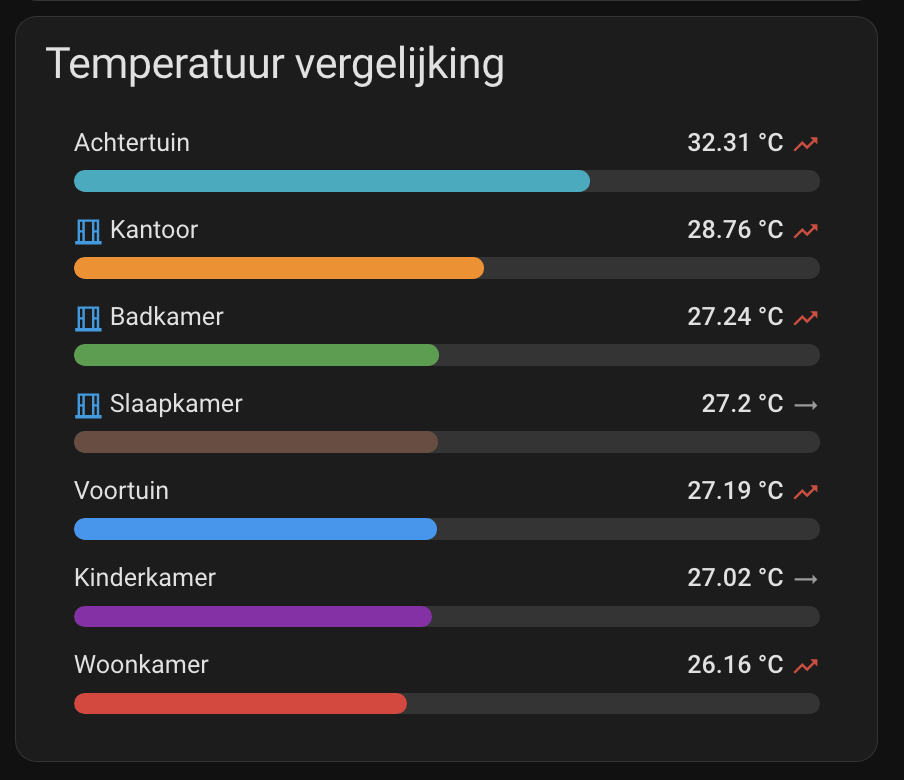

# Bar Chart Card

[](https://github.com/hacs/integration)
[](https://github.com/Wolk9/lovelace-bar-chart-card/releases)
[](LICENSE)

A minimal Home Assistant Lovelace card that shows one or more entities as
labelled horizontal bars in a single card — handy for comparing values
across rooms/devices (e.g. temperature per room) at a glance.



## Installation

### HACS (recommended)

1. In HACS, go to **Frontend** → menu (⋮) → **Custom repositories**.
2. Add this repository URL, category **Dashboard**.
3. Install **Bar Chart Card** and reload/hard-refresh your dashboard.

### Manual

1. Download `bar-chart-card.js` from the [latest release](../../releases/latest).
2. Copy it into `config/www/`.
3. Add it as a dashboard resource: **Settings → Dashboards → Resources → Add resource**, URL `/local/bar-chart-card.js`, type **JavaScript Module**.

## Configuration

| Name | Type | Default | Description |
|------|:----:|:-------:|-------------|
| `type` | string | **required** | `custom:bar-chart-card` |
| `title` | string | | Optional card header |
| `min` | number | `0` | Minimum value for the bar scale |
| `max` | number | `100` | Maximum value for the bar scale |
| `unit` | string | `''` | Unit suffix shown after each value |
| `sort` | string | | `asc` (coolest/lowest on top) or `desc` (warmest/highest on top). Omit to keep the configured order |
| `outdoor_entity` | string | | Entity ID of an outdoor temperature sensor. Rows whose value is higher than this sensor get an open-window icon (🪟), suggesting you could air out instead of cooling actively |
| `trend` | boolean | `false` | Show a trend arrow (↗/↘/→) comparing each entity's current value to its value 15 minutes ago |
| `trend_threshold` | number | `0.1` | Minimum change over 15 minutes before a row counts as rising/falling instead of steady |
| `entities` | list | **required** | List of entities to show, see below |

### `entities` options

| Name | Type | Required | Description |
|------|:----:|:--------:|-------------|
| `entity` | string | Yes | Entity ID |
| `name` | string | No | Overrides the displayed name (defaults to friendly name) |
| `color` | string | No | Bar color (hex or CSS color, defaults to `var(--primary-color)`) |

### Example

```yaml
type: custom:bar-chart-card
title: Temperature comparison
min: 15
max: 40
unit: "°C"
sort: desc
outdoor_entity: sensor.outdoor_temperature
trend: true
entities:
  - entity: sensor.living_room_temperature
    name: Living Room
    color: "#e53935"
  - entity: sensor.office_temperature
    name: Office
    color: "#fb8c00"
  - entity: sensor.bedroom_temperature
    name: Bedroom
    color: "#6d4c41"
```
